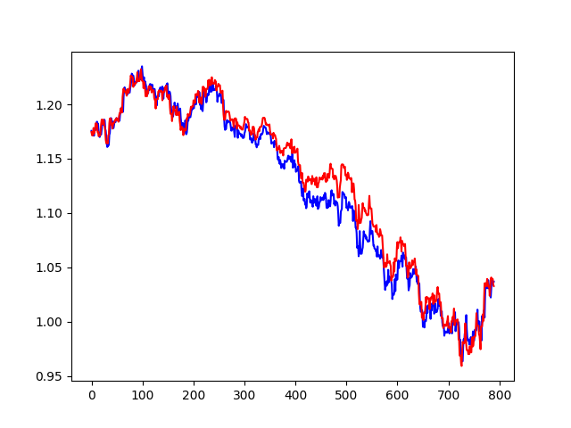
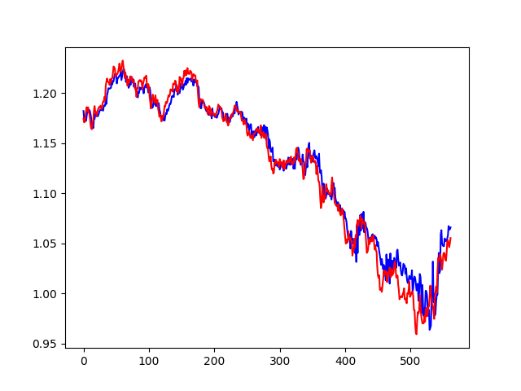

# Forex Technical Analysis with LSTM Model

This project is a custom implementation of the paper [Forecasting directional movement of Forex data using LSTM with technical and macroeconomic indicators](https://jfin-swufe.springeropen.com/articles/10.1186/s40854-020-00220-2) with improvements.


In this project, ensemble of two LSTM models is implemented to predict the directional movement of the EUR/USD currency pair. The models are trained on historical data of the EUR/USD price pairs. The ensemble model was able to achieve a profitibility of 58%, being able to make the correct decision (to buy or sell) in 58% of decisions made when testing on unseen price data. 

# Models and Data

In day trading, technical indicators are mathematical patterns derived from historical price data that are used to determine whether a currency pair is overbought or oversold. They are used alongside fundamental indicators to make buy and sell decisions. The 8 technical indicators used in this project have different periods and are calculated based on the Opening, High, Low, and Closing prices.

The LSTM model is a type of recurrent neural network that can process and predict sequences of data. It is trained on the processed forex data to learn patterns and make predictions for future closing prices. The trained model can be used to make predictions for any future time period.

The ensemble consists of two LSTM models, one trained on technical indicators, and the other trained on macroeconomic indicators.
In our technical model, 7 different technical indicators are used along with the closing price as the training dataset. 

* MA with a period of 10
* MACD with short- and long-term periods of 12 and 26, respectively
* ROC with a period of 2
* Momentum with a period of 4
* RSI with a period of 10
* BB with period of 20
* CCI with a period of 20

To derive these indicators, we start with the Opening, High, Low and Closing price data.

In day trading, technical indiactors are mathematically derived patterns based on historical price data that are used to determine whether a stock or currency pair is over or under bought. They are used alongside financial indicators to tell whether to buy or sell at any point. 

The macroeconomic LSTM model utilizes several financial factors, including interest rates, Federal Reserve (FED) funds rate, inflation rates, Standard and Poor’s (S&P) 500, and Deutscher Aktien IndeX (DAX) market indexes. Each factor has important effects on the trend of the EUR/USD currency pair.

## Prediction Graphs
The following two graphs show the predicted and actual price movements of the EUR/USD currency pair over 500 time steps (days) for the fundamental and technical models respectively.
| Fundamental Analysis | Technical Analysis |
|----------------------|-------------------|
|  |  |


The models generate predictions for the price, and then the prediction of each model is put into one of three classes: price increase, price decrease, no action. If the prediction of a model is makes the price increase above a threshold, the decision output will be price increase, if it is below a threshold then the decision will be price decrease. If the change is within the threshold, then no action will be taken. 

To determine the threshold τ for generating the no-action class, we used a two-phase approach. First, we performed histogram analysis on the closing prices of the EUR/USD pair to determine the upper bound of the threshold value. The upper bound was calculated as the value larger than 85% of the differences between two consecutive days' closing values. Second, we determined the final threshold value τ that maximizes entropy by iterating over potential threshold values with increments of 0.00001 up until the upper bound of the threshold found in the histogram analysis. The entropy value is calculated for each distribution of increases, decreases, and no-change values, and the distribution that gives the best entropy is used to determine the increase, decrease, and no-change classes.
The entropy is calculated as $$H(X) = - \sum{p_i * log(p_i)}$$


If both models predict a price increase, then the final model predicts a price increase, same for price decrease, and for no action. If one model predicts no action then the final decision is no action. However, if the two models differ and don't predict no action, then we choose the correct decision based on the model that predicted the smallest increase.

## Ensemble Process
1. Train LSTM models on technical and macroeconomic indicators.
2. Generate predictions for the price using both models.
3. Calculate threshold value based on entropy.
4. Put each model's prediction into one of three classes: price increase, price decrease, no action.
5. If both models predict the same class, then the final model predicts that class.
6. If one model predicts no action, then the final decision is no action.
7. If the two models differ and don't predict no action, then the correct decision is based on the model that predicted the smallest increase.

## Ensemble Model Prediction Results

This table shows the prediction results of the ensemble model for various experiments conducted with different thresholds and ways of picking a decision if the two models are in conflict. The models were tested over 500 days of data (500 data points) for the EURUSD currency pair. 

| Experiment | Correct Decisions (C) | False Decisions (F) | No Decisions (N) | Correct Decisions (%) |
|------------|----------------------|--------------------|--------------------|-------------------------|
| Technical | 214 | 209 | 140 | 50.59% |
| Technical, threshold x3 | 102 | 94 | 367 | 52.04% |
| Fundamental | 282 | 262 | 247 | 51.83% |
| Fundamental, threshold x3 | 240 | 234 | 89 | 50.63% |
| Hybrid | 235 | 223 | 105 | 51.28% |
| Combination (Lowest Loss) | 210 | 196 | 157 | 51.72% |
| Combination (No Action) | 49 | 46 | 468 | 51.57% |
| Combination (Return Technical) | 206 | 200 | 157 | 50.78% |
| Combination (Return Fundamental) | 203 | 203 | 157 | 50% |
| Combination (Largest Change) | 198 | 208 | 157 | 48.81% |
| Combination (Smallest Change) | 211 | 195 | 157 | 52.01% |
| Combination (Smallest Change, threshold x3) | 72 | 53 | 438 | 57.6% |
| Combination (Lowest Loss, threshold x3) | 70 | 55 | 438 | 56% |


## File descriptions

applyindicators.py - Applies 8 different technical indicators to raw data, and outputs data.csv. Note that the first few lines of the output file will have some NaN values some indicators require a few time steps before starting.

lstm.py - Takes what applyindicators.py outputted and trains a lstm model, then saves the model into mymodel file. 

plot.py - Runs predictions from a saved model. 

Threshold.py - has function get_threshold() to get best threshold when given pandas dataframe of closing prices

## Debug

I always get an import error when following tensorflow tutorials. To fix it I changed 
```
from tensorflow.keras.models import Sequential
from tensorflow.keras.layers import Dense
from tensorflow.keras.layers import LSTM
```
to 
```
from tensorflow.python.keras.models import Sequential
from tensorflow.python.keras.layers import Dense
from tensorflow.python.keras.layers import LSTM
```
So if you are encountering something similar you can try to change it back. 

## Citations
- Yıldırım, D. C., Toroslu, I. H., & Fiore, U. (2021). Forecasting directional movement of Forex data using LSTM with technical and macroeconomic indicators. Financial Innovation, 7(1), 1-36. https://doi.org/10.1186/s40854-020-00220-2
- Dukascopy website: https://www.dukascopy.com/swiss/english/marketwatch/historical/
